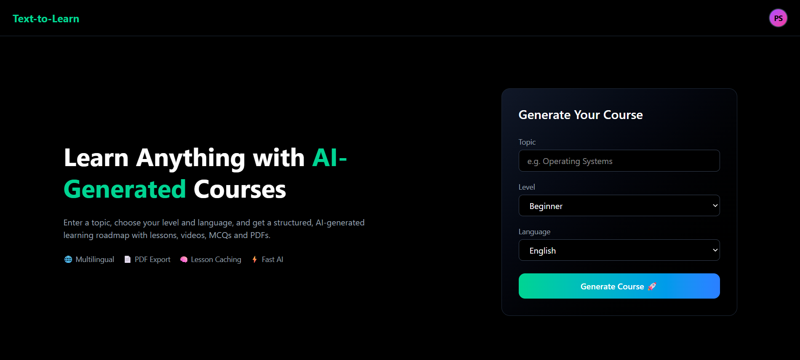
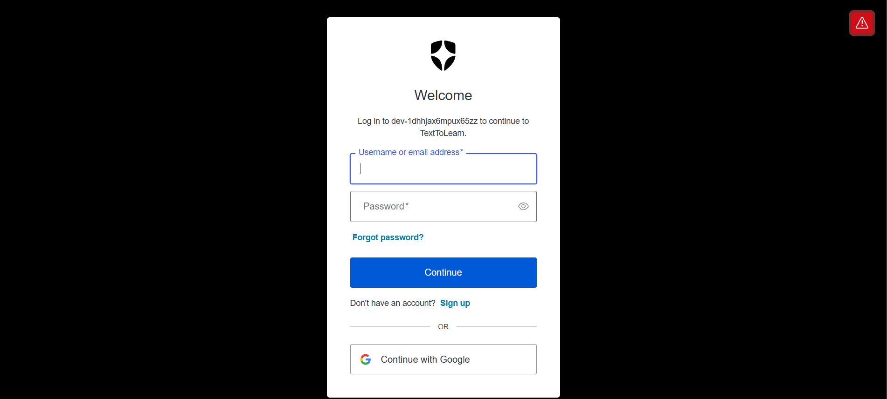
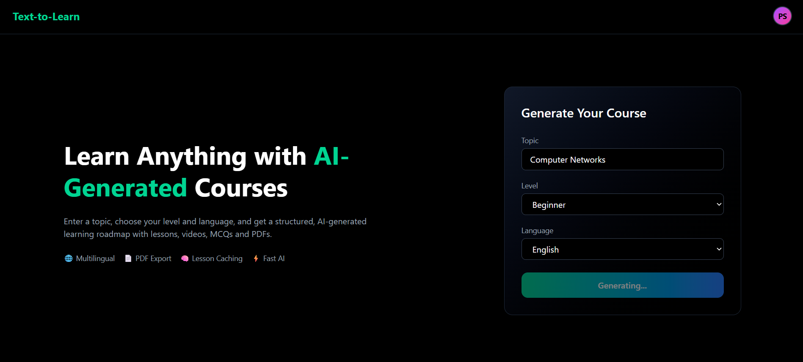
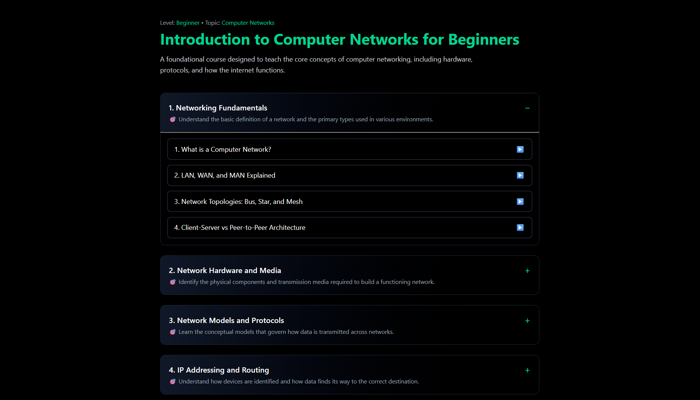
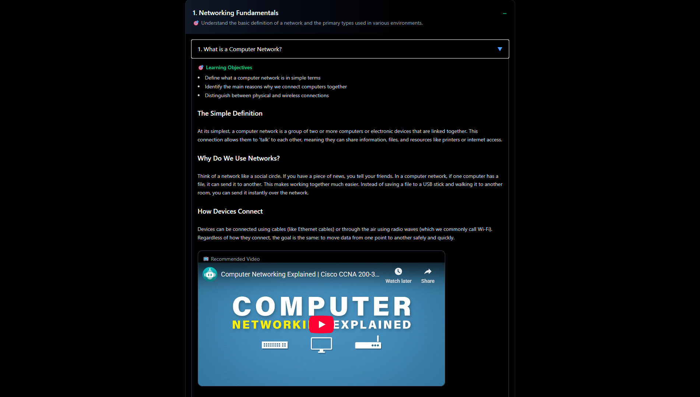
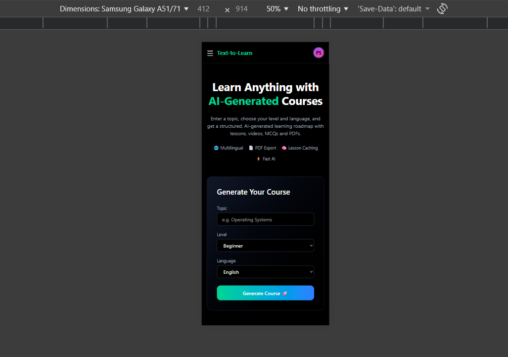

# 🚀 Text-to-Learn — AI-Powered Learning Platform

> **An end-to-end, production-deployed AI learning platform that generates structured courses, lessons, and videos — built with a real frontend, real backend, real authentication, and real deployment challenges.**

🔗 **Live App:** https://text-to-learn-psi.vercel.app  
🔗 **Backend API:** https://text-to-learn-backend.onrender.com  

---

## 📌 What is Text-to-Learn?

**Text-to-Learn** is a full-stack AI learning platform where users can:

- Generate **AI-powered courses** from a topic
- Break courses into **modules & lessons**
- Auto-attach **relevant YouTube videos** per lesson
- Securely log in using **Auth0**
- Access their personalized learning content anywhere

This is **not a demo app** — it is fully deployed and production-ready.

---

## ✨ Key Features

- 🧠 **AI Course Generation** (topic → structured roadmap)
- 📚 **Lesson-wise Content Generation**
- 🎥 **Automatic YouTube Video Recommendations**
- 🔐 **Secure Authentication (Auth0 + JWT)**
- 🌐 **Production-grade Deployment (Vercel + Render)**
- 📱 **Responsive UI (Desktop + Mobile)**
- ⚡ **Real API Integration (YouTube Data API)**

---

## 📸 Screenshots

### 🏠 Home Page
> Landing page where users generate AI-powered courses



---

### 🔐 Auth0 Authentication
> Secure Universal Login powered by Auth0



---

### 🚀 Course Generation
> Generate structured courses from any topic



---

### 📚 Course & Modules View
> Automatically generated modules and lessons



---

### 🎥 Lesson with Video Integration
> Lesson content with auto-attached YouTube video



---

### 📱 Mobile Responsive UI
> Fully responsive experience on mobile devices



## 🛠 Tech Stack

### Frontend
- React (Vite)
- Tailwind CSS
- Auth0 React SDK
- Deployed on **Vercel**

### Backend
- Node.js
- Express.js
- MongoDB
- JWT Authentication (Auth0)
- YouTube Data API
- Deployed on **Render**

---

## 🏗 System Architecture

```text
User (Browser)
   ↓
Frontend (Vercel)
   ↓ Auth0 Token (JWT)
Backend API (Render)
   ↓
MongoDB + AI APIs + YouTube API
```
---
## 🔐 Authentication (Auth0)

This project uses **Auth0 Universal Login** to provide secure, enterprise-grade authentication.

### Authentication Flow
- Users authenticate via Auth0 Universal Login
- Access tokens are:
  - Stored securely by Auth0
  - Sent with each protected request as:
    ```
    Authorization: Bearer <JWT>
    ```
---
### Backend Token Verification
The backend validates every protected request by checking:
- ✅ **Audience**
- ✅ **Issuer**
- ✅ **Signing Algorithm (RS256)**
- ✅ **JWKS endpoint** for public key verification

This authentication setup closely mirrors **real-world enterprise systems** used in production environments.

---

## 🌐 API Flow Example

### Course Generation Flow

```text
Frontend → Backend API → AI Service → Database → Response
```
```text
POST /api/courses/generate
Authorization: Bearer <JWT>
Content-Type: application/json
```
---
## Backend Processing Steps
- Verifies the JWT token
- Authenticates the user
- Generates AI-powered course content
- Saves the course to the database
- Returns structured course data to the frontend
---
## 📁 Project Structure
```text
Text-to-Learn/
├── client/        # React frontend (Vite + Tailwind)
├── server/        # Node.js backend (Express + MongoDB)
├── screenshots/   # Screenshots used in README
└── README.md👨‍💻
```
---

## 👨‍💻 Author

**Harsh Tadas**  
Full-Stack Developer  

Focused on building **real, production-ready systems** with:
- Secure authentication
- Scalable backend APIs
- Clean frontend architecture
- Real-world deployment practices

🔗 **GitHub:** https://github.com/harshtadas8
