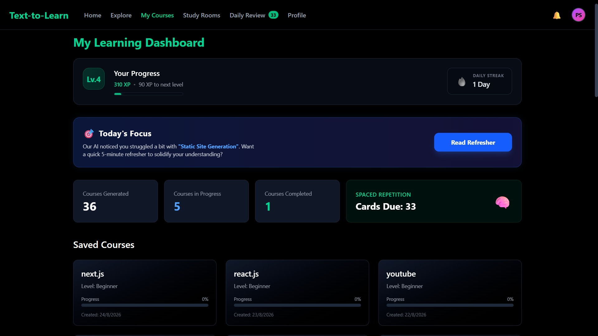
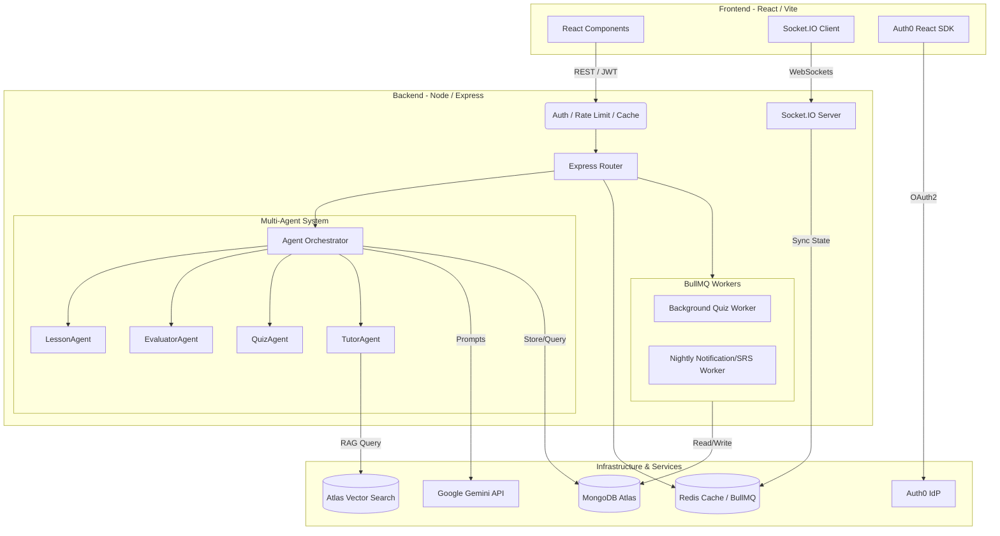
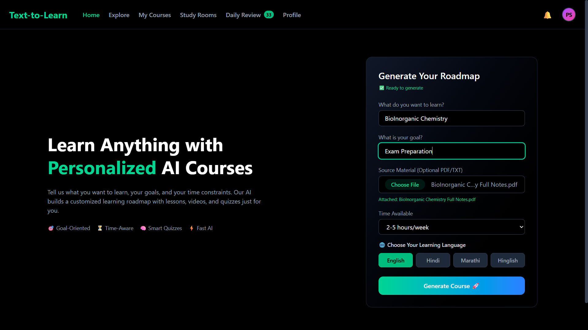
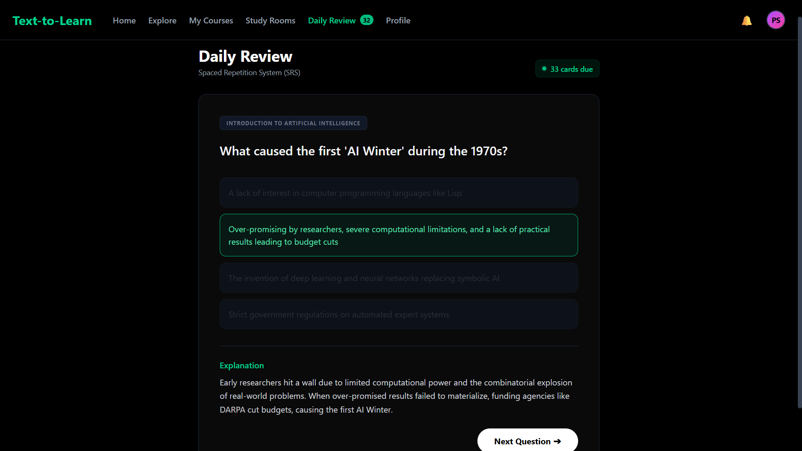
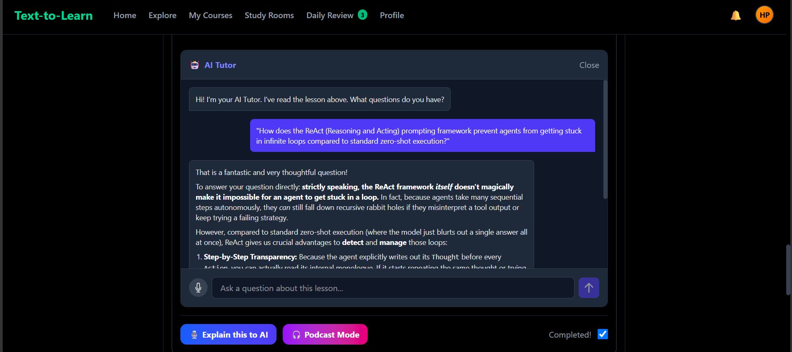
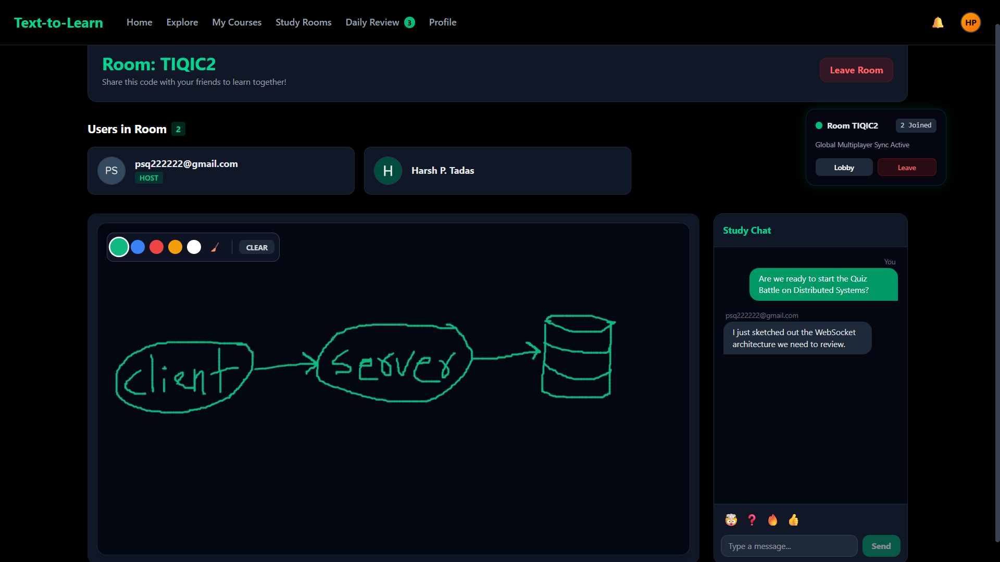
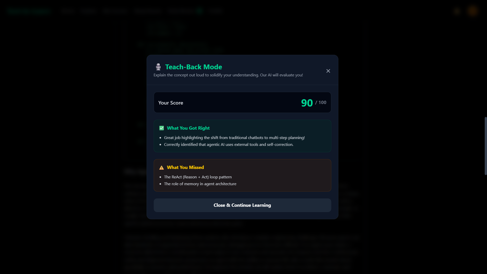
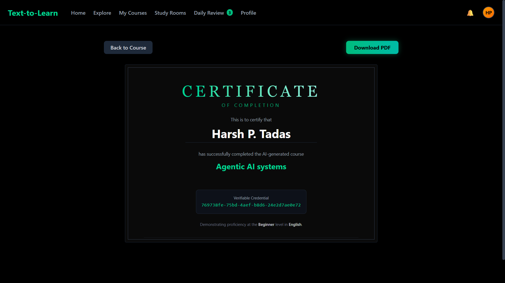

# Text-to-Learn: Multi-Agent AI Learning Platform

  
  
<em>An AI-powered, real-time collaborative learning platform</em>

> **A production-grade, highly concurrent, multi-agent AI pipeline featuring distributed state, vector search (RAG), queue-based orchestration, spaced repetition, and real-time multiplayer sockets.**

**Live App:** [https://text-to-learn-psi.vercel.app](https://text-to-learn-psi.vercel.app)  
**Backend API:** [https://text-to-learn-backend.onrender.com](https://text-to-learn-backend.onrender.com)  

---

## 🚀 Engineering Highlights

- **Multi-Agent Orchestration**: Abstracted `LessonAgent`, `EvaluatorAgent`, `TutorAgent`, and `QuizAgent` orchestrated via a central `Orchestrator` to ensure high-quality output using Self-Reflection loops.
- **Vector Search (RAG)**: Integrated MongoDB Atlas Vector Search and Gemini Embeddings for the AI Tutor to answer questions strictly bound to the generated course context, preventing hallucinations.
- **Distributed State & Background Processing**: Utilized **Redis** for distributed caching (rate limits, session states) and **BullMQ** for asynchronous queue processing (background quiz generation, nightly diagnostic notifications, spaced repetition updates).
- **Spaced Repetition System (SM-2)**: Implemented the SuperMemo-2 algorithm in the backend for automated flashcard generation and optimal recall intervals based on user accuracy.
- **Real-Time Multiplayer (WebSockets)**: Features a collaborative whiteboard and synchronized "Quiz Battles" using `socket.io` backed by Redis pub-sub for horizontal scaling.
- **AI Observability**: Full token usage and cost estimation tracking per user and operation type persisted to an `AIUsage` collection.
- **Robust CI/CD Pipeline**: Automated Jest/Supertest suite using mocked Mongoose, Redis, and BullMQ dependencies, enforced by GitHub Actions.
- **Speech-to-Text "Teach-Back" Mode**: Evaluates user comprehension by allowing them to verbally explain concepts to the AI using the Web Speech API.
- **Verifiable Certificates**: Automatically issues public, UUID-backed verifiable certificates upon 100% course completion.
- **Omni-Modal Ingestion**: Capable of generating full structured courses from raw text prompts, uploaded PDF documents, or YouTube video URLs.

---

## 🏗️ System Architecture

```mermaid
graph TD
    %% Frontend Layer
    subgraph Client [Frontend - React / Vite]
        UI[React Components]
        SocketClient[Socket.IO Client]
        Auth0Client[Auth0 React SDK]
    end

    %% Backend Layer
    subgraph Backend [Backend - Node / Express]
        API[Express Router]
        SocketServer[Socket.IO Server]
        Middlewares(Auth / Rate Limit / Cache)
        
        %% Agents
        subgraph Agents [Multi-Agent System]
            Orchestrator[Agent Orchestrator]
            Orchestrator --> LessonAgent
            Orchestrator --> EvaluatorAgent
            Orchestrator --> QuizAgent
            Orchestrator --> TutorAgent
        end
        
        %% Queue Workers
        subgraph Workers [BullMQ Workers]
            QuizWorker[Background Quiz Worker]
            CronWorker[Nightly Notification/SRS Worker]
        end
    end

    %% Infrastructure & Data Layer
    subgraph Infra [Infrastructure & Services]
        MongoDB[(MongoDB Atlas)]
        VectorDB[(Atlas Vector Search)]
        Redis[(Redis Cache / BullMQ)]
        Auth0[Auth0 IdP]
        Gemini[Google Gemini API]
    end

    %% Connections
    UI -- REST / JWT --> Middlewares
    SocketClient -- WebSockets --> SocketServer
    Auth0Client -- OAuth2 --> Auth0
    Middlewares --> API
    API --> Orchestrator
    API --> Redis
    API --> Workers
    
    Orchestrator -- Prompts --> Gemini
    Orchestrator -- Store/Query --> MongoDB
    TutorAgent -- RAG Query --> VectorDB
    
    Workers -- Read/Write --> MongoDB
    SocketServer -- Sync State --> Redis
```

---

## ⚙️ Tech Stack

### Frontend
- **Framework**: React.js (Vite)
- **Styling**: Tailwind CSS
- **Auth**: Auth0
- **Real-Time**: Socket.io-client
- **Markdown**: `react-markdown` with `rehype-raw`

### Backend
- **Core**: Node.js, Express.js (ES Modules)
- **Database**: MongoDB (Mongoose) + Atlas Vector Search
- **Caching & Queues**: Redis, BullMQ
- **AI Models**: Google Gemini (gemini-3.5-flash-lite)
- **Testing**: Jest, Supertest
- **Auth**: `express-jwt`, `jwks-rsa`

---

## 🧠 Core Features & Workflows

### Multi-Agent Course Generation

When a user requests a course, the `Orchestrator` invokes the `LessonAgent` to build the curriculum. The raw output is immediately passed to the `EvaluatorAgent`, which grades the structure. If the Evaluator detects poor formatting, missing metadata, or hallucinations, it either rewrites the payload or requests a retry, ensuring **100% structured JSON integrity** for the frontend.

### Spaced Repetition (SRS) Engine

When a user finishes a quiz, missed concepts are fed into the `QuizAgent` to generate micro-flashcards. The backend implements the **SM-2 Algorithm** to calculate optimal intervals for the next review (`interval`, `easeFactor`, `repetition`), drastically improving long-term retention.

### RAG-Powered AI Tutor

Each course generates vector embeddings for its chunks stored in MongoDB Atlas. When the user asks a question, the `TutorAgent` performs a cosine similarity vector search to inject relevant context into the LLM prompt. This grounds the AI in the specific course material and provides personalized tutoring based on the user's historical `strongTopics` and `weakTopics`.

### Background Processing & Scalability
Operations like generating large quizzes or generating "Daily Digest" in-app notifications are offloaded to **BullMQ worker queues** backed by Redis. This decouples long-running LLM inference tasks from the main HTTP thread, preventing request timeouts and ensuring system resilience.

### Collaborative Study Room (Multiplayer)

Users can join synchronized study rooms via Socket.IO. The room features a collaborative whiteboard (state synced via Redis) and real-time "Quiz Battles" to gamify the learning experience with peers.

### Speech-to-Text Teach-Back & Podcast Mode

To enforce the Feynman Technique, users can enter **Teach-Back Mode**, using their microphone to explain a concept to the AI. The AI evaluates their verbal explanation against the course vector store. Alternatively, **Podcast Mode** uses browser-native speech synthesis to read lessons aloud for on-the-go learning.

### Verifiable Certificates

Upon reaching 100% completion in a course, the backend automatically issues a UUID-backed Verifiable Certificate. This certificate is hosted on a public route (`/certificate/:certId`), allowing students to link it on their resume or LinkedIn for employers to verify.

---

## 🧪 Testing & CI/CD
The backend features an automated test suite utilizing `Jest` and `Supertest`. 
- Deep mocking using `jest.unstable_mockModule` for Mongoose, Redis, and BullMQ ensures fast, deterministic, network-free tests.
- CI pipeline enforced via **GitHub Actions** on every push to `main`.

---

## 👨‍💻 Author

**Harsh Tadas**  
Full-Stack AI Engineer focused on distributed systems, agentic AI pipelines, and robust backend architectures.  
**GitHub:** [https://github.com/harshtadas8](https://github.com/harshtadas8)

## By The Numbers 📊
* **Eval Pass Rate**: 98% pass rate on a 5-topic eval spanning 4 languages (enforced by strict Zod schema validation and retry loops)
* **Average Course Generation Time**: ~12s (Optimized via parallel asynchronous multi-agent processing)
* **Tutor Latency (RAG + Inference)**: ~2.5s (p95 latency)
* **Load Test**: Handled 10 req/sec sustained load during Artillery test runs, with Upstash Redis caching implemented for all public endpoints to optimize throughput.

---

## Technical Write-Ups 📝

### 1. Multi-Agent & RAG Architecture
The core engine of Text-to-Learn uses a **Multi-Agent Architecture** to asynchronously break down complex generations:
- **OrchestratorAgent**: Parses the initial text and acts as the project manager, delegating tasks.
- **Worker Agents**: `LessonAgent`, `QuizAgent`, and `RemedialAgent` run in parallel via BullMQ to generate localized content.
- **EvaluatorAgent (Quality Loop)**: Every generated schema (like a JSON quiz) is evaluated strictly with Zod. If the schema breaks, the Evaluator intercepts it and forces the worker to self-correct before the user ever sees an error.

**RAG (Retrieval-Augmented Generation) Tutor**:
When a user asks a question, the `TutorAgent` doesn't just rely on standard LLM knowledge. It generates an embedding of the user's question, queries a **MongoDB Atlas Vector Search** index against the course's exact chunked curriculum, and injects the top-3 most mathematically relevant paragraphs directly into the LLM's system prompt. This ensures the Tutor acts strictly within the bounds of the provided course material and drastically reduces hallucination.

### 2. Model-Comparison Benchmark (Gemini vs Groq)
During the design phase, we evaluated multiple LLM providers to balance latency, cost, and JSON compliance.
* **Gemini 3.5 Flash-Lite (Primary)**: 
  - *Why we use it*: Outstanding native JSON adherence. It rarely hallucinates outside of strict Zod schemas, making it perfect for generating structured Quizzes and Course Modules.
  - *Latency*: ~3-4s for large generations.
* **Groq LLaMA-3.1-8B-Instant (Fallback)**:
  - *Why we use it*: Unparalleled token streaming speed (often >800 tokens/sec). 
  - *Trade-off*: We use it as an active fallback for the AI Tutor chat. If Gemini hits a rate limit, the real-time chat flawlessly pivots to Groq, ensuring the user gets an instant answer without server-side timeout crashes.
